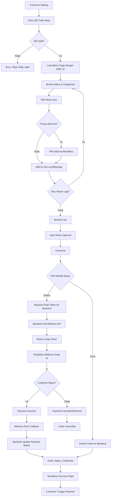
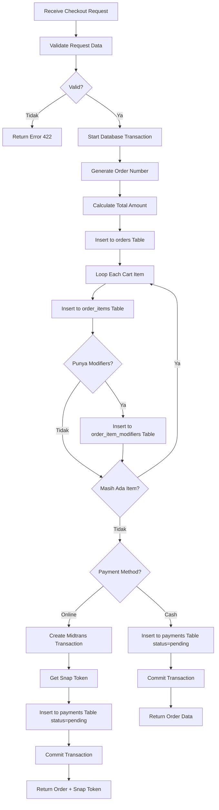
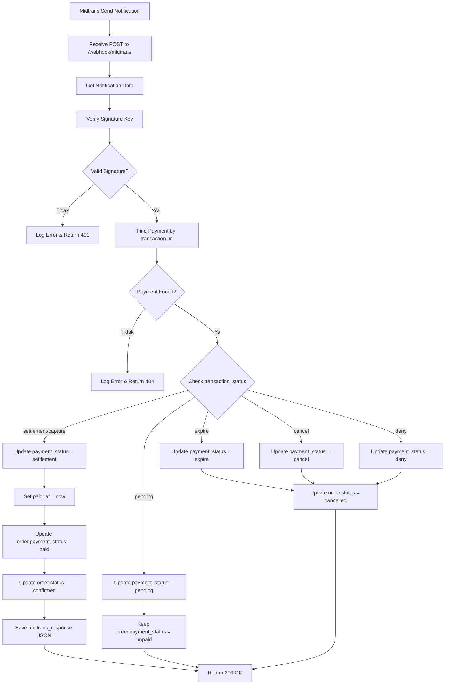
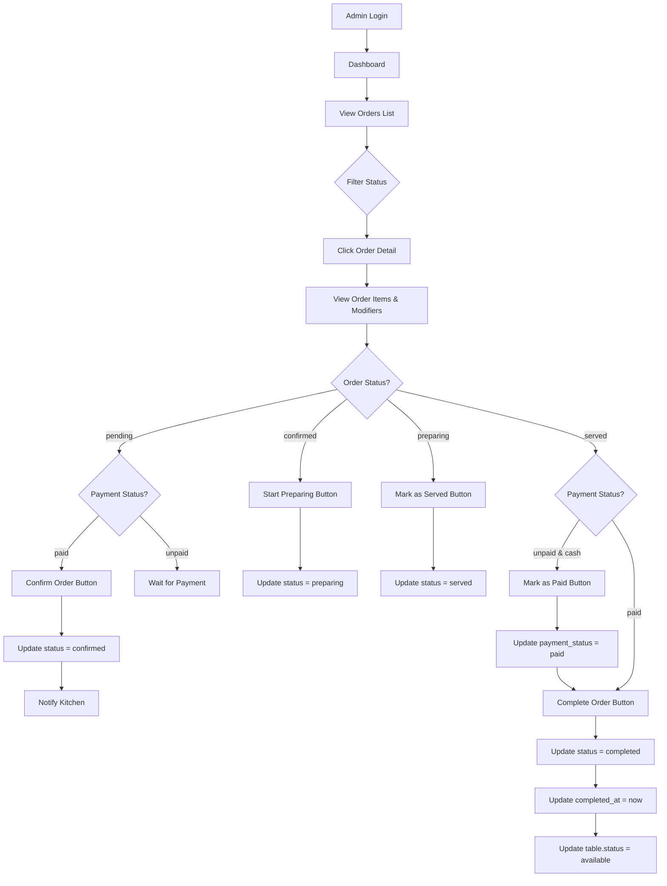
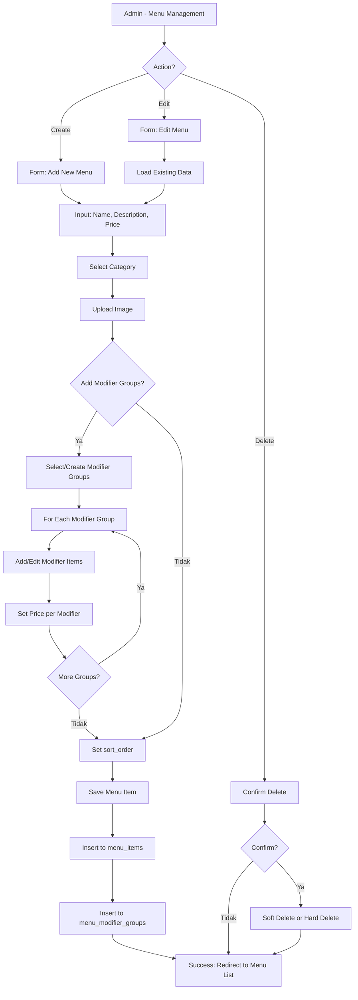
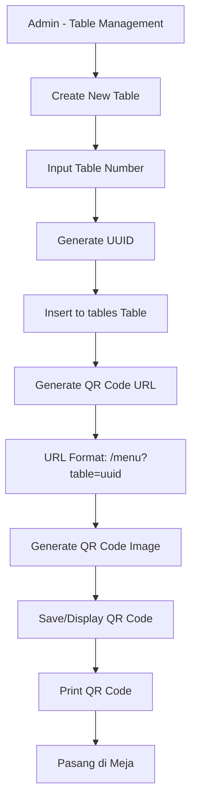
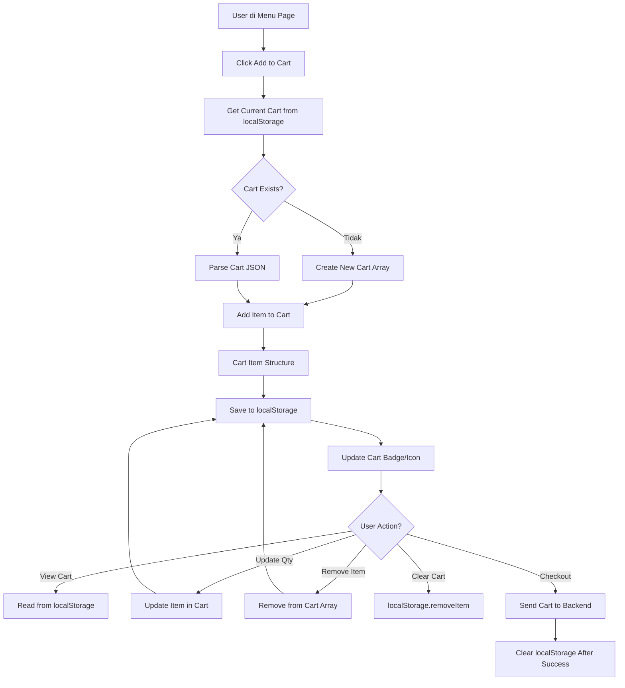
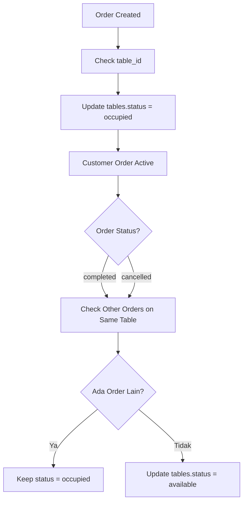
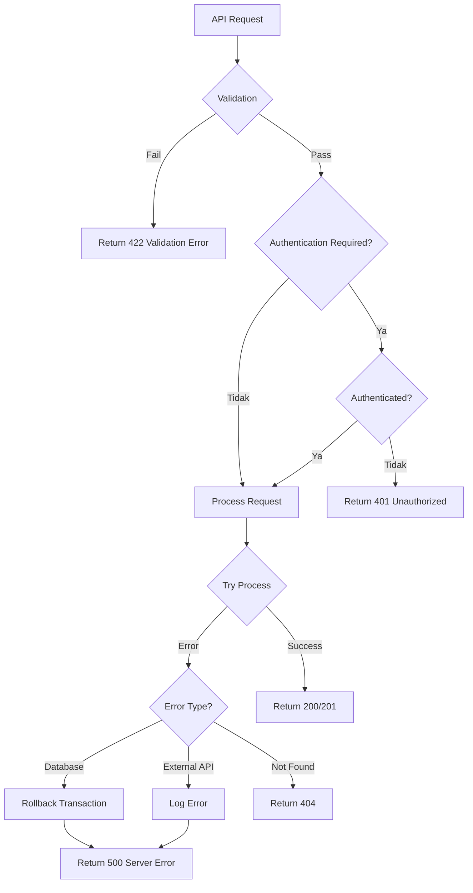

# Flowchart ScanDine System

## 1. Customer Order Flow (Main Flow)



---

## 2. Backend Order Processing Flow



---

## 3. Midtrans Payment Callback Flow



---

## 4. Admin Order Management Flow



---

## 5. Menu Management Flow



---

## 6. QR Code Generation Flow



---

## 7. Cart Management Flow (Client-Side)



---

## 8. Data Structure in Cart (localStorage)

```javascript
// Cart Structure Example
[
    {
        id: 1,
        menu_id: 5,
        name: "Nasi Ayam Katsu",
        price: 17000,
        quantity: 2,
        image_url: "...",
        notes: "Pedas ya",
        modifiers: [
            {
                modifier_group_id: 1,
                modifier_group_name: "Add On Topping",
                modifier_item_id: 3,
                modifier_item_name: "Bakso 3Pcs",
                price: 3000,
                quantity: 1,
            },
            {
                modifier_group_id: 2,
                modifier_group_name: "Pilihan Minuman",
                modifier_item_id: 8,
                modifier_item_name: "Es Teh Jumbo",
                price: 7000,
                quantity: 1,
            },
        ],
        subtotal: 44000, // (17000 * 2) + (3000 * 2) + (7000 * 2)
    },
];
```

---

## 9. Table Status Update Flow



---

## 10. Error Handling Flow



---

**Last Updated:** December 13, 2025  
**Format:** Mermaid Flowchart (Support GitHub & Markdown Viewers)
